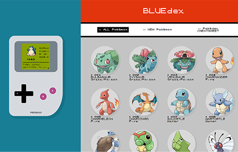
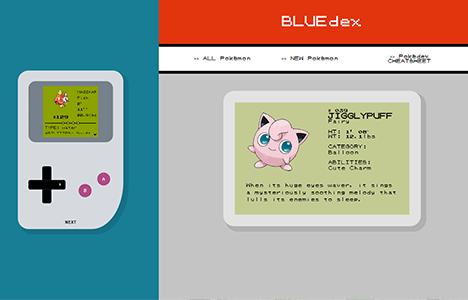
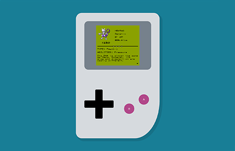

Essa página está em  Português.
To view this page in  English, [click here](./README.md).

---

#  BLUEdex


Esta aplicação estilo Pokédex permite listar e registrar _Pokémon_ em memória.

## 🔗 Demo

- [bluedex.fly.dev](https://bluedex.fly.dev/)

## 🟰 Tabela de Conteúdos

<details open>
<summary>expand / collapse</summary>
&nbsp;

- [Informações Gerais](#ℹ️-informações-gerais)
- [Tecnologias](#-tecnologias)
- [Screenshots](#%EF%B8%8F-screenshots)
- [Instalação](#%EF%B8%8F-instalação)
- [Autoria](#-autoria)
- [Aquele Abraço](#-aquele-abraço)

</details>

## ℹ️ Informações Gerais

Exercício proposto:

> _O projeto Pokedéx envolve a criação de um aplicativo com critérios de avaliação que consideram desde a validação de dados até o deploy, com ênfase na qualidade técnica e na usabilidade do sistema. É necessário criar telas EJS responsivas, um menu de navegação, estilização das páginas e rotas no arquivo `index.js`, utilizando o Express para armazenar os dados em memória. Além disso, a aderência ao padrão MVC e uma organização adequada no repositório do Github são cruciais. Após o cadastro de informações, o sistema deve exibir mensagens de sucesso, e o projeto deve passar pela etapa de deploy para estar disponível ao público-alvo._

## 🧮 Tecnologias

- Node.js
- Express
- EJS
- CSS

## 🖼️ Screenshots

<details open>
<summary>expand / collapse</summary>
&nbsp;







</details>

## ⚙️ Instalação

<details open>
<summary>expand / collapse</summary>
&nbsp;

Clone the project

```bash
> git clone https://github.com/miaslls/BLUEdex.git
```

Go to the project directory

```bash
> cd BLUEdex
```

Install dependencies

```bash
> npm install
```

Run the project

```bash
> npm run start
```

</details>

## 👩‍💻 Autoria

- [@miaslls](https://www.github.com/miaslls)

## 🫶 Aquele Abraço

- [pokemon.com](https://www.pokemon.com/us/pokedex/)
- [pokemondb.net](https://pokemondb.net/)
- [dripicons](http://demo.amitjakhu.com/dripicons/)

&nbsp;

&nbsp;

&nbsp;

&nbsp;

&nbsp;

&nbsp;

&nbsp;

&nbsp;

&nbsp;

&nbsp;

&nbsp;

&nbsp;

&nbsp;

&nbsp;

&nbsp;

&nbsp;

&nbsp;

&nbsp;

&nbsp;

&nbsp;


