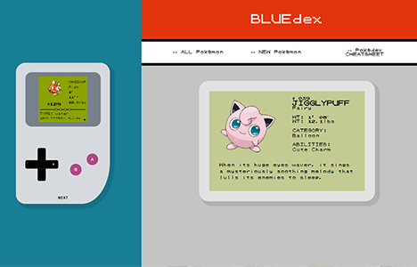
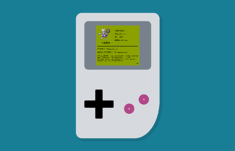

This page is in  English.
Para visualizar essa página em  Português, [clique aqui](./README-ptbr.md).

---

#  BLUEdex


This Pokedéx-style application allows listing and in-memory registration of _Pokémon_.

## 🔗 Demo

- [bluedex.fly.dev](https://bluedex.fly.dev/)

## ℹ️ General Info

Proposed exercise:

> _The Pokedex project involves creating an application with evaluation criteria that consider everything from data validation to deployment, with an emphasis on technical quality and system usability. It is necessary to create responsive EJS screens, a navigation menu, page styling, and routes in the `index.js` file, using Express to store data in memory. Additionally, adherence to the MVC pattern and proper organization in the Github repository are crucial. After registering information, the system should display success messages, and the project must go through the deployment stage to be available to the target audience._

## 🧮 Technologies

- Node.js
- Express
- EJS
- CSS

## 🖼️ Screenshots






## ⚙️ Install and Run

Clone the project

```bash
> git clone https://github.com/miaslls/BLUEdex.git
```

Go to the project directory

```bash
> cd BLUEdex
```

Install dependencies

```bash
> npm install
```

Run the project

```bash
> npm run start
```

## 👩‍💻 Authors

- [@miaslls](https://www.github.com/miaslls)

## 🫶 Acknowledgements

- [pokemon.com](https://www.pokemon.com/us/pokedex/)
- [pokemondb.net](https://pokemondb.net/)
- [dripicons](http://demo.amitjakhu.com/dripicons/)

 

 

 

 

 

 

 

 

 

 

 

 

 

 

 

 

 


